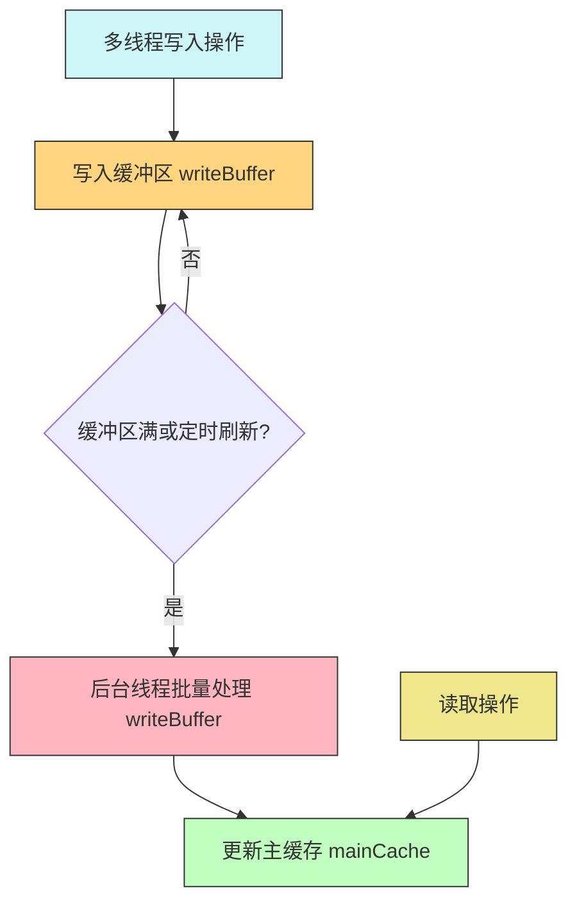

1. **缓存优化**：使用<font style="color:rgb(216,57,49);">逻辑过期</font>防止 Redis 热点 Key 的缓存击穿问题；使用<font color="red">缓存空值</font>解决Redis Key的缓存穿透问题； 
2. **数据一致性**：更新数据库后删除缓存，若删除失败消息队列补偿重试，TTL 兜底共同保证数据一致性； 
3. **多级缓存**：使用 Caffeine 本地缓存 和 Redis 缓存搭建二级缓存架构，提高热点数据访问速度，降低 Redis 压力； 

## 一、缓存击穿
:::info 背景
对于平台的准点开放、限时的一些活动信息 或者 热搜榜单，它们是一个热点数据，在活动上线之前，我们需要提前预热：将其存入 Redis 中进行缓存，目的是提高系统的响应速度，降低数据库的访问压力。

当把高并发场景的热点数据存入 Redis 缓存，会面临：缓存击穿的问题。如果缓存的**热点数据失效过期**的瞬间，有大量的请求访问，那么大量请求将到达数据库，导致数据库瞬时压力过大甚至可能崩溃。

:::

解决缓存击穿的问题，有两种解决方案：一是使用<font color="blue">互斥锁</font>。二是使用<font color="blue">逻辑过期</font>。

**<font style="color:rgb(222,120,2);">互斥锁</font>**

当缓存失效时，有大量请求都会去访问数据库，希望获取数据且重新建立缓存再返回给用户数据。**但其实只需要一个请求对应的线程去访问数据库，重新建立起缓存即可**。

在请求到达缓存后，若缓存不存在，尝试获取互斥锁，大量的请求中，只有一个线程获取锁成功，由这个线程去查询数据库，重新建立缓存，而其他的请求线程获取锁失败，都**休眠一小段时间后**，不断**重试**获取缓存数据。

> 互斥锁的方案，最终只有一个线程去访问数据库，降低了数据库的访问压力，解决了缓存击穿的问题，但是其他的线程需要等待，性能受到影响，对于外界可能表现出一些不可用或者延迟的现象，但是保证了强一致性。

**<font style="color:rgb(222,120,2);">逻辑过期</font>**

针对热点数据我们**不设置TTL**，也就是说Redis Key永不失效，而是在Redis的Value数据中新增一个属性存储过期时间字段。

在获取key时需要**检查过期时间字段**，判断是否过期，如果发现过期，则尝试获取互斥锁，大量的请求中，只有一个线程获取锁成功，由这个线程去开启一个独立线程去查询数据库重建缓存，而其他线程就直接返回Redis中的旧数据。

> **这个逻辑过期的方案，最终也是只有一个线程去访问数据库，降低了数据库的访问压力，解决了缓存击穿的问题，并且线程无需等待，性能比较好，保证了服务的可用性，但是部分请求返回了Redis的旧数据，没有保证一致性。**
>

这两个方案的对比，其实就是 **可用性和一致性的抉择 (CAP定理) **：

+ 互斥锁保证了一致性，牺牲了可用性；
+ 逻辑过期保证了可用性，而牺牲了一致性


**针对这个热搜榜单，它其实是一种社交媒体类型的数据，对于一致性的要求不是很高，因此最终为了保证服务的可用性，选择使用逻辑过期的方案来解决缓存击穿问题。**

在测试阶段，(手动修改数据库中的数据，使得Redis和MySQL数据不一致)，然后等到Redis中的数据逻辑上过期后，使用 Jmeter 进行压力测试，在5s内5000个线程并发请求，QPS是1000，<font style="color:rgb(216,57,49);">查看日志可以发现只有一次查询数据库重建缓存的过程</font>，**证明在高并发的场景下，没有让所有的请求打到数据库，成功使用逻辑过期方案解决缓存击穿问题**。缺点就是在缓存尚未重建完毕时，前面一小部分的请求(大概200ms是缓存重建的耗时)获取到的是旧的Redis数据，后面所有的请求获取到的是正确的数据。

:::warning 注意
金融类的业务场景，是要求强一致性的，会使用互斥锁方案。

:::

## 二、缓存穿透

### 2.1 问题解决

:::info 背景

平台中的商铺信息属于变动少、访问频繁的数据，适合提前写入 Redis 缓存，从而降低数据库压力。商铺信息查询通常根据商铺 ID 进行。如果有大量恶意请求不断查询不存在的商铺 ID，由于 Redis 中没有对应缓存，这些请求会直接打到数据库，形成缓存穿透问题，即数据在 Redis 和数据库中都不存在。

:::

解决缓存穿透问题，有两种常见方案：

**缓存空值**
当接收到查询请求时，先查询 Redis 缓存，如果缓存不存在，再去查询 MySQL 数据库。如果数据库中也不存在该商铺信息，则写入空值（如空字符串或特殊标记）到 Redis 中。这样，下次查询相同 ID 时，会直接命中空值缓存，从而避免数据库访问。
这种方案实现简单，虽然会占用一些额外内存，但可以通过给空值设置 较短 TTL 自动过期，控制内存消耗。

**布隆过滤器**
在系统初始化时，将数据库中的所有商铺 ID 通过多个**哈希**函数映射到布隆过滤器中。查询请求到来时，先查询布隆过滤器判断数据是否存在：如果不存在，直接返回；如果可能存在，再查询 Redis 或 MySQL。
布隆过滤器的优点是可以在访问缓存和数据库之前快速拦截无效请求，但存在误判的可能（哈希碰撞可能导致不存在的数据被判定为存在），且布隆过滤器加入数据后删除单个元素的实现相对复杂，需要额外维护组件。

**方案对比**

缓存空值：实现简单，额外内存可控（TTL），适合商铺数量不是很大的平台。

布隆过滤器：存在误判可能，实现复杂，需要维护，适合数据量大、高并发场景。

基于当前平台商铺数量不大，且实现复杂度和维护成本也是考虑因素，我最终选择缓存空值的方案来防止缓存穿透。

### 2.2 衍生思考

#### （1）布隆过滤器原理  

布隆过滤器（Bloom Filter）是一种 **空间高效的概率型数据结构**，用于判断一个元素是否属于一个集合。其核心思想是使用 **位数组 + 多个哈希函数** 来映射和判断：

- **初始化**：创建长度为 `m` 的位数组，全为 0  
- **添加元素**：用 `k` 个独立哈希函数计算元素哈希值，将对应位置为 1  
- **查询元素**：计算查询元素的 `k` 个哈希值，如果所有对应位都是 1 → **元素可能存在**；如果有任意一位为 0 → **元素一定不存在**  

> **特点**  
> - 优点：内存占用小，查询和插入都是 O(1)  
> - 缺点：存在 **误判**（可能把不存在的元素判断为存在，但不会漏判存在元素）  

#### （2）为什么会误判？如何优化  

- **误判原因**：  
  - 多个元素可能映射到相同位（哈希碰撞）  
  - 查询不存在元素时，如果所有对应位都为 1，就会误判为存在  

- **优化方案**：  
  1. **增加位数组长度 `m`** → 减少冲突  
  2. **增加哈希函数数量 `k`** → 通常 `k ≈ (m/n) ln 2`，最小化误判率  
  3. **分层或分段布隆过滤器** → 多级过滤降低误判  
  4. **可控误判** → 根据业务容忍度调整 `m` 和 `k`  

#### （3）为什么无法删除？如何解决  

- **原因**：  
  - 位共享导致无法单独清除元素，否则可能影响其他元素  
  - 传统布隆过滤器不支持删除  

- **解决方案**：  
  1. **计数布隆过滤器（Counting Bloom Filter）**  
     - 用计数器数组替代位数组  
     - 插入元素 → 哈希位置计数 +1  
     - 删除元素 → 哈希位置计数 -1，计数为 0 时重置位  
  2. **周期性重建布隆过滤器** → 适合频繁变化的集合  
  3. **结合逻辑过期或 TTL** → 缓存穿透场景下刷新布隆过滤器，误判影响可控  

## 三、数据一致性
### 3.1. 问题解决
:::info 背景
把数据存入Redis缓存，MySQL中的数据是会更新的，需要设法保证Redis和MySQL的数据一致性。

:::

在<font style="color:rgb(222,120,2);">更新数据库后，再同步删除缓存</font>，若删除缓存失败，则发送一个消息到Kafka中，消息中携带上要删除的key的信息，同时需要启动Kafka消费者，消费者接收到消息后执行缓存删除逻辑。如果删除缓存失败，消息队列的重试机制就可以发挥作用，**梯度重试**的去删除缓存，**尽量保证**数据的**最终一致性**。

> 梯度重试（Exponential Backoff）是一种用于处理失败的重试机制，它会根据重试的次数逐渐增加重试的间隔时间，避免在短时间内频繁地重复操作，从而减少系统的负载和资源消耗。
>
> + 删除缓存还是更新缓存？
>     - 更新缓存：每次更新数据库都更新缓存，无效写操作较多
>     - 删除缓存：<font style="color:rgb(216,57,49);">更新数据库时让缓存失效</font>，查询时再更新缓存
>

:::warning 注意
当然保证数据一致性还有很多方案，例如binlog 监听同步，<font style="color:rgb(216,57,49);">延迟双删，Canal + 异步更新缓存</font>。当然上述方法都不能保证MySQL数据和Redis缓存的数据强一致性，只是保证最终一致性。

**无论选择哪种方案都需要为缓存设置TTL，作为兜底策略。"设置过期时间"就像是给缓存加了"自动清理保险"，即使我们主动删除失败，系统也能在一定时间后自我修复，避免永久性的数据不一致。**

:::

### 3.2 衍生思考
#### （1）使用消息队列重试，如果一直失败怎么办？
**记录失败次数**，程序里检测达到最大重试次数后，**触发告警，人工介入排查原因**

#### （2）为什么是先更新MySQL，后删除Redis缓存？
选择“先更新数据库，再删除缓存”，目的是<font style="color:rgb(216,57,49);">尽量缩短不一致窗口</font>。

<font style="background-color:#CEF5F7;">更新DB --> 删缓存</font>

`从不一致窗口的角度来看`，这里数据不一致的时间，就是缓存删除的时间。

`从数据不一致的原因来看`，初始状态为`DB：X1  缓存：null`

    1. 读请求：缓存未命中，读取数据库的值为`X1`
    2. 写请求：请求更新数据库的值为`X2`，并且执行删除缓存的操作
    3. 读请求：将`X1`写回缓存

这样最终状态是`DB：X2``缓存：X1` 不一致

> **但上述情况出现的概率很小**：因为 `更新MySQL的耗时 >> 读请求写入Redis缓存的耗时`，正常流程下就是读缓存未命中-->读数据库拿到值写入redis-->写请求完成mysql更新并且删除缓存，即最终状态为`DB：X2  缓存：null` 。

`考虑更新失败的情况：万一数据库出了啥问题更新失败`，Redis没删除，数据库和缓存还是一致的，`万一缓存删除失败`，可以消息队列重试或者设置过期时间兜底，这就是可修复的不一致。

<font style="background-color:#CEF5F7;">删缓存 --> 更新DB</font>

`从不一致窗口的角度来看`，这里数据不一致的时间，看起来是缩短了。确实，如果没有高并发，看起来可以忽略不计，但高并发会让<font style="color:rgb(216,57,49);">不一致窗口</font>变得很大。

从数据不一致的原因来看，分析如下，初始状态为` DB：X1  缓存：null`

    1. 写请求：删除缓存
    2. 读请求：缓存未命中、读取数据库的值，更新缓存值为X1
    3. 写请求：更新数据库的值为X2

> `更新MySQL的耗时 >> 删除Redis缓存的耗时`，因此上述情况发生概率很大。

`考虑DB更新失败的情况：`缓存已经不在了，但是数据库没更新，就会导致超卖。

| **<font style="color:rgb(0, 0, 0);">顺序</font>** | **<font style="color:rgb(0, 0, 0);">不一致窗口</font>** | **<font style="color:rgb(0, 0, 0);">风险级别</font>** |
| :---: | :---: | :---: |
| <font style="color:rgb(0, 0, 0);">先更新DB，再删缓存</font> | <font style="color:rgb(0, 0, 0);">只有“删除失败”才不一致</font> | <font style="color:rgb(0, 0, 0);">低</font> |
| <font style="color:rgb(0, 0, 0);">先删缓存，再更新DB</font> | <font style="color:rgb(0, 0, 0);">更新期间一定存在风险窗口</font> | <font style="color:rgb(0, 0, 0);">高</font> |


#### （3）什么是延迟双删
    1. 先删除缓存
    2. 更新数据库
    3. 延迟一定时间后，删除缓存

## 四、多级缓存
### 4.1 问题解决
:::info 背景
对于一些存储在Redis中的过热的key，例如秒杀优惠券的详情页，它本身是**更新频率极低的，访问频率很高**的数据。而Redis单实例性能有上限，单个Redis的压力过大，Redis可能成为系统瓶颈。

:::

考虑使用**<font style="background-color:#CEF5F7;">Caffeine本地缓存+Redis缓存</font>**，搭建二级缓存，本地缓存将**热 Key 的访问压力分散到各个应用实例的内存中，显著降低Redis的访问压力。**

搭建二级缓存架构后，用户的请求流程将会是

+ 先从本地缓存中获取数据，如果本地缓存有数据则返回数据
+ 否则从Redis缓存中获取数据。<font style="color:rgb(222,120,2);">如果Redis缓存中有数据则更新本地缓存</font>，然后将数据返回客户端
+ 如果Redis缓存没有数据则去数据库查询数据，然后更新Redis缓存，接着再更新本地缓存，最后将数据返回给客户端

当然使用本地缓存，有一个<font style="color:#DF2A3F;">问题</font>是，<font style="color:rgb(222,120,2);">当后端服务</font>**<font style="color:rgb(222,120,2);">集群部署</font>**<font style="color:rgb(222,120,2);">时</font>，如果数据库的数据有更新的情况，本地缓存的数据和数据库的数据会出现**数据不一致窗口**，如果要更新/删除本地缓存的数据，因为是集群部署，就要把所有节点的本地缓存的数据都进行更新/删除，此时这个实现稍微有些复杂，例如发送广播消息，所有实例节点监听广播消息，然后在本地缓存更新/删除。

可以使用一种更简单的方法，就是我们可以**<font style="color:rgb(222,120,2);">给本地缓存设置较短时间的TTL</font>**，这样我们可以不用去管本地缓存的数据更新，而是仅依靠TTL，去不断刷新本地缓存的数据。

### 4.2 衍生思考
#### （1）Redis单实例压力过大，为什么不搭建Redis集群
第一考虑成本问题，第二`即使搭建了Redis集群，热Key存在于某个Redis实例上`，依然会使得单台Redis实例压力过大，除非对该热Key进行分片，分散到不同的Redis实例上，这样实现复杂度又增加了。所以可以选择本地缓存方案，简单。

#### （2）分布式缓存
**本地缓存**：是单台应用服务器维度的缓存，会占用服务器本身存储空间。假设一个分布式系统有5台应用服务器，那么这5台服务器中的缓存内容是**<font style="background-color:#CEF5F7;">独立且相同</font>**的，彼此不相互影响。<font style="color:#DF2A3F;">本地缓存更多的是用来频繁地读，而非写，数据会随着应用程序的重启而丢失。</font>

优点：本地缓存不需要远程网络请求去操作内存空间，没有额外的性能消耗，所以读取速度快。

缺点：不能进行大数据量存储；<font style="color:rgb(222,120,2);">应用程序集群部署时</font>，会存在数据更新问题（数据更新不一致）

**分布式缓存**：一种专门做存储的系统（单台服务器或集群）如Redis。只要向其存储一份数据，那么接入该分布式缓存的所有应用服务器可以获取到相同的内容，保证了数据的一致性。举个例子，淘宝商品库存可以放到Redis中，用户在服务器A下了一单库存减少为99，同步更新到Redis，其他用户在服务器B看到的库存也会变成99。

+ 支持大数据量存储：**分布式缓存是独立部署的进程**，拥有自身独自的内存空间，不需要占用应用程序进程的内存空间，并且还支持横向扩展的集群方式部署，所以可以进行大数据量存储。
+ 数据不会随着应用程序重启而丢失
+ 数据集中存储，保证数据的一致性
+ 数据读写分离，高性能，高可用

#### （3）Caffeine的实现原理
Caffeine 在设计上注重提高数据访问速度和并发性能。它使用 ConcurrentHashMap 作为底层存储结构，并结合 W-TinyLFU 作为缓存淘汰策略。W-TinyLFU 由 Window LRU、TinyLFU 和 Segmented LRU 组成，其中 Window LRU 为新数据提供试用期，TinyLFU 通过 Count-Min Sketch 统计访问频率并决定是否允许数据进入主缓存，而主缓存则通过 Segmented LRU 管理热点数据，从而减少<font color="pink">缓存污染</font>并提高缓存命中率。

> 1. **缓存污染（Cache Pollution）** 指的是： **一些“不会被再次访问”的数据进入缓存，占据了缓存空间，把真正的热点数据挤出缓存。**
>
> 2. SLRU = 分段 LRU
>
>    - 新数据先进 Probation（试用）
>
>    - 热点数据晋升 Protected（保护）
>
>    - 一次性冷数据快速淘汰
>
>    - 避免缓存污染，提高命中率
>
> 3. 当 **Window LRU 淘汰一个元素时**：
>
> 拿这个元素（候选者）去和 **Main Cache 里最差的元素** 比较访问频率。
>
> ```
> Window淘汰元素  VS  Main里最不热门元素
> ```
>
> 谁访问次数多，谁留下。

为了提升并发性能，Caffeine 采用无锁设计和写缓冲机制（writeBuffer）。多个线程将访问或写入操作记录到缓冲区中，由后台线程批量处理这些操作，从而减少锁竞争并提高整体吞吐量。



Caffeine 在高并发下不容易发生缓存抖动（cache thrashing），主要因为它在数据进入主缓存之前做了“频率过滤”，避免大量一次性数据挤掉热点数据。
